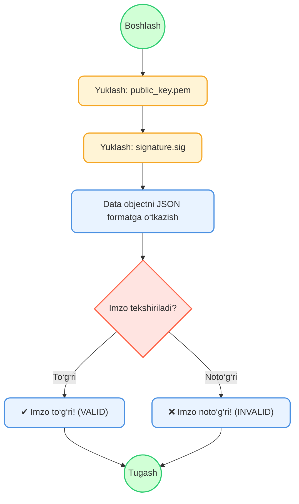
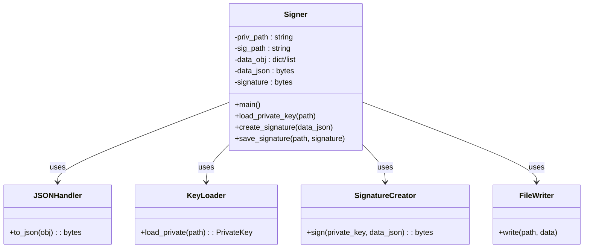

# -1
## 1. Key Generation Diagram  ## 2. Signer Class Diagram  ## 3. Verifier Flowchart




```mermaid
flowchart TD
    A((Boshlash)) --> B["keys папкасини yaratish (os.makedirs)"]
    B --> C["RSA private key yaratish (rsa.generate_private_key)"]
    C --> D["Private keyni PEM formatga o'girish"]
    D --> E>private_key.pem fayliga yozish]
    E --> F["Public key yaratish (private_key.public_key)"]
    F --> G["Public keyni PEM formatga o'girish"]
    G --> H>public_key.pem fayliga yozish]
    H --> I["Chop etish: 'Kalitlar yaratildi!'"]
    I --> J((Tugash)) 

